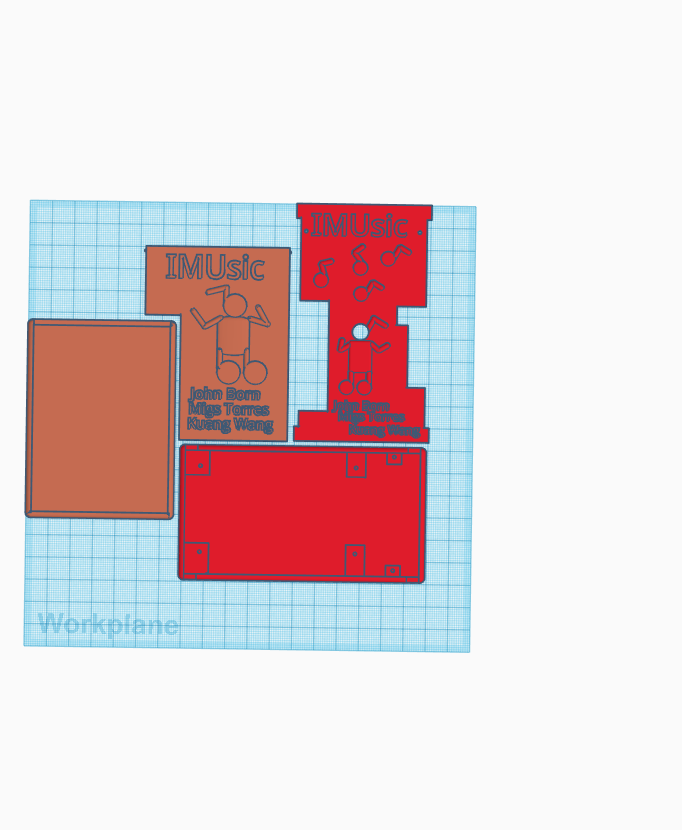

# Music Wearables

Music and movement contribute heavily to emotional expression during a performance. Our IMUsic devices allow musicians and dancers to control music in real time through body movement. Taking the orientation of a person's body, this project creates sound through a virtual synthesizer for an unforgettable performance!

## Technical Overview

This project uses the MPU-9250 Inertial Measurement Unit (IMU) to determine the orientation of wrists and ankles. It then sends that data to a computer through Wi-Fi using an ESP32. The computer intakes these UDP messages formatted as Open Sound Control (OSC) messages. Using SuperCollider (a virtual Synthesizer IDE), these OSC messages dictate various synth controls such as pitch, volume, panning, and many others.

## Images

## Contributors

* **John Born**
* **Miguel Torres**
* **Kuang Wang**

## Acknowledgments

* **Kristina Miller** - Our ECE 445 - Senior Design TA. She helped significantly with making this project a success during the design process and creation of the hardware / software.
